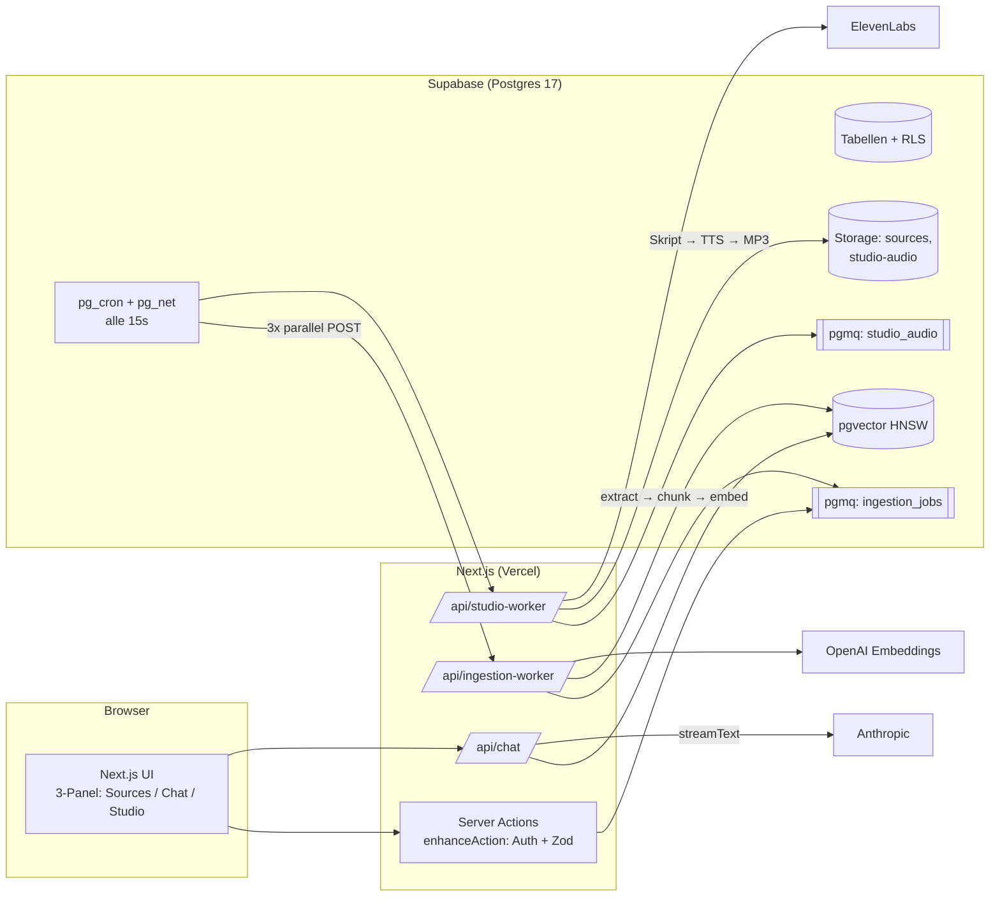
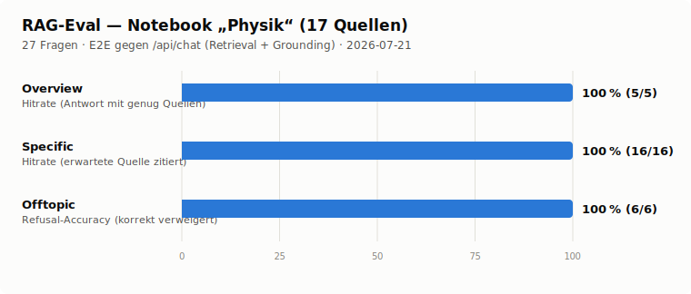

# GoatbookLM 🐐

Ein selbst gehosteter NotebookLM-Klon: Quellen hochladen, Fragen stellen, **belegte** Antworten bekommen — und aus den eigenen Dokumenten Reports, Lernkarten, Quizze und einen gesprochenen Zwei-Personen-Podcast generieren.

Gebaut in ~3 Tagen, komplett mit [Claude Code](https://claude.com/claude-code) — siehe [Wie das hier gebaut wurde](#wie-das-hier-gebaut-wurde).

---

## Was es tut

**Der Core Loop:**

1. **Notebooks** anlegen — jedes Notebook ist ein isolierter Wissensraum.
2. **Quellen hinzufügen** — PDF, Word (docx), Excel (xlsx), CSV, Markdown, Text-Dateien, Bilder (Vision-OCR via Claude), eingefügter Text oder Web-URLs. Verarbeitung läuft asynchron über eine Postgres-Queue; die UI pollt den Status (`pending → processing → ready`).
3. **Chatten mit Grounding** — Antworten kommen ausschließlich aus den eigenen Quellen, jede Faktaussage trägt ein Inline-Zitat `[n]`. Hover über ein Zitat öffnet eine Vorschau (Quelle, Fundstelle, Passage), Klick springt in den Reader und highlightet den zitierten Chunk. Decken die Quellen eine Frage nicht ab, verweigert das System transparent statt zu halluzinieren.
4. **Studio-Artefakte generieren:**
   - **Reports** — Briefing Doc, Study Guide oder Blog Post, live gestreamt.
   - **Flash Cards** — Lernkarten-Deck aus den Quellen.
   - **Quiz** — Multiple Choice mit Hints und Erklärungen; „Erklären"-Button springt mit Kontext in den Chat.
   - **Audio Overview** — ein generierter Podcast (Deep Dive / Brief / Critique / Debate) mit zwei Hosts, gesprochen von ElevenLabs, mit Fortschrittsanzeige, Player und Transkript.
5. **Notizen** — Notebook-eigene Notizen (TipTap-Editor mit Autosave), Chat-Antworten als Notiz speichern (Zitate bleiben erhalten), Notizen zu Quellen konvertieren.

UI durchgängig Deutsch, Design-System in [`DESIGN.md`](DESIGN.md).

## Stack

| Schicht | Technologie |
|---|---|
| Frontend | Next.js 15 (App Router, Turbopack), React 19, Tailwind v4, shadcn/ui, TipTap |
| Backend | Next.js Server Actions + Route Handler, Supabase (Postgres 17, Auth, Storage) |
| Datenbank-Extensions | **pgvector** (Embeddings), **pgmq** (Queues), **pg_cron + pg_net** (Worker-Trigger) |
| LLM | Anthropic `claude-sonnet-5` (Chat, Summaries, Vision, Studio) via Vercel AI SDK |
| Embeddings | OpenAI `text-embedding-3-small` (1536 Dim.) |
| TTS | ElevenLabs `eleven_v3` (Text-to-Dialogue, zwei Stimmen pro Stream) |
| Deploy-Ziel | Vercel + Supabase Cloud |

## Architektur

Der zentrale Entscheid: **Postgres-native Infrastruktur.** Keine externen Queues, kein Redis, kein ffmpeg, keine Worker-Prozesse — alles läuft über Supabase-Extensions und Next.js-Route-Handler. pg_cron feuert alle 15s HTTP-POSTs (pg_net) an die Worker-Routen der App; die ziehen Jobs aus pgmq-Queues.



### Ingestion-Pipeline

Add-Source-Actions sind **enqueue-only** (Millisekunden): `pending`-Row anlegen, Datei direkt in Storage, Job in die pgmq-Queue — fertig. Die eigentliche Arbeit macht der Worker (`app/api/ingestion-worker/route.ts` → `lib/ingestion/`):

```
extract → sanitize → chunk → embed → persist → summarize → ready
```

- **Extract** — pro Typ ein Extractor (`lib/ingestion/extractors/`): PDF via unpdf, Web via fetch + Readability (mit vollständigem SSRF-Guard inkl. Per-Redirect-Hop-IP-Pinning), docx via mammoth, xlsx via exceljs, CSV → Markdown-Tabelle, Bilder via Claude Vision (Beschreibung + OCR in einem Call). Magic-Byte-Validierung und Content-Hash-Dedupe vorgelagert.
- **Chunk** — ~800 Tokens pro Chunk, 100 Tokens Overlap (cl100k_base), byte-sichere Char-Offsets für das Citation-Highlighting.
- **Embed** — `embedMany` mit Request-Batches unter einem 240k-Unit-Budget (Puffer unter OpenAIs 300k-Token-Limit pro Request), Chunk-Inserts in 500er-Batches.
- **Summarize** — pro Dokument eine Claude-Zusammenfassung, selbst embedded (`sources.summary_embedding`); danach debounced eine Notebook-Gesamtzusammenfassung.

**Parallelität:** pg_cron feuert pro Tick **3 parallele Worker-Invocations**, jede liest genau **einen** Job (`READ_BATCH_SIZE=1`). Bewusst so statt einem Batch-Read: pgmq zählt `read_ct` pro Message-Delivery — bei Batches würde ein einziger Poison-Job seine gesunden Batch-Nachbarn mit in den Dead-Letter-Zähler reißen. Ein Job, ein Read, ein Attempt-Count; nach 5 Versuchen Dead-Letter.

### Retrieval & Grounding

`app/api/chat/route.ts` + `lib/chat/`:

- **Multi-Granularität:** parallel Top-20 Chunk-Treffer (`match_chunks`) und Top-4 Dokument-Summaries (`match_source_summaries`), gemerged nach Cosine-Score, Top-12 in den Kontext. Übersichtsfragen („Worum geht es hier insgesamt?") werden so aus Summaries beantwortbar, Detailfragen aus Chunks.
- **Kein Cosine-Gate, kein Reranker (v1):** ein hartes 0.35-Similarity-Gate war drin und wurde bewusst entfernt — ob die Quellen eine Frage abdecken, entscheidet der Grounding-Prompt, nicht ein Schwellwert.
- **Guardrail in 3 Schichten:** (1) System-Prompt mit wörtlich definierter Verweigerungsantwort, (2) deterministisches Gate bei 0 `ready`-Quellen, (3) Post-Validierung aller `[n]`-Marker gegen die tatsächlich retrieveten Chunks — halluzinierte Zitate werden gestrichen. Quellentext wird escaped und als Daten, nicht als Instruktionen behandelt (Prompt-Injection-Härtung).
- Persistenz der Chat-History in `after()` — überlebt Client-Disconnects; abgebrochene Streams werden mit „unvollständig"-Hinweis gerettet.

### RAG-Eval

Das Retrieval wird end-to-end gemessen (`evals/rag/`): das Eval loggt sich als echter User ein und stellt 27 Fragen über die echte `/api/chat`-Strecke (Embedding → Multi-Granularitäts-Retrieval → Grounding-Prompt) gegen ein Notebook mit 17 Physik-Quellen (16 arXiv-Paper Gravitationsphysik/Kosmologie + 1 Notiz).



| Kategorie | Fragen | Hit-Kriterium | Ergebnis |
|---|---|---|---|
| **Overview** | 5 | Antwort zitiert ≥ 2–3 verschiedene Quellen (Querschnittsfrage) | 100 % |
| **Specific** | 16 | Detailfrage zu genau einem Paper — erwartete Quelle unter den Zitaten | 100 % |
| **Offtopic** | 6 | korrekt verweigert, 0 Zitate — inkl. zwei physiknaher Hard Negatives | 100 % |

Jede Frage läuft gegen leere Chat-History (bestehende Messages werden geparkt und wiederhergestellt), Refusals werden über das `isRefusal`-Signal des Streams erkannt, nicht über Text-Matching. Fair einzuordnen: die Specific-Fragen enthalten distinktives Fach-Vokabular ihres Ziel-Papers — das misst die Baseline, nicht den härtesten Fall. Genau dafür ist das Harness da: paraphrasierte Fragensets und Rerank-Varianten lassen sich damit messbar vergleichen (siehe Roadmap).

Reproduzieren: `node evals/rag/run-eval.mts` (braucht laufenden Dev-Server + lokale Supabase). Output: CSV pro Frage, Summary-CSV, das SVG oben (light/dark) und ein Results-JSON mit den Volltext-Antworten.

### Audio-Pipeline (Podcast)

Eigene pgmq-Queue `studio_audio`, eigener Worker (`app/api/studio-worker/route.ts` → `lib/studio/audio-worker.ts`), als **Phasen-Job** mit Checkpoint statt Ein-Schuss:

1. **`script`** — Claude generiert per Structured Output ein Format-abhängiges Dialogskript (Sprecher-getaggte Turns, Backchannel-Cues, whitelisted `eleven_v3`-Audio-Tags wie `[laughs]`; Critique ist Single-Host). 30k-Zeichen-Cap als Kostenbremse.
2. **`tts`** — Skript in ≤1800-Zeichen-Dialogblöcke gesplittet; pro Block ein ElevenLabs-**Text-to-Dialogue**-Call (beide Stimmen in einem Stream). Jedes Segment landet einzeln in Storage; der Job darf sich über mehrere Worker-Ticks strecken und setzt am Checkpoint wieder auf — ein Retry zahlt nie das Skript doppelt.
3. **`finalize`** — Segmente werden zu einer MP3 konkateniert (eigener ID3/Xing-Frame-Stripper in `lib/studio/mp3.ts` — kein ffmpeg auf Vercel), Upload in den privaten Bucket, Playback via Signed URL.

### Datenmodell

| Tabelle | Zweck |
|---|---|
| `notebooks` | Container pro User, inkl. gecachter Notebook-Summary |
| `sources` | Quellen mit Status-Lifecycle, `content_text`, Content-Hash (Dedupe), Doc-Summary + Summary-Embedding |
| `chunks` | Text-Chunks mit `vector(1536)`-Embedding (HNSW-Index) + Char-Offset-Metadata |
| `messages` | Chat-Verlauf inkl. validierter Citations (jsonb) |
| `notes` | Notizen (TipTap-JSON), inkl. Chat-Origin-Notizen mit Markdown + Citations |
| `studio_artifacts` | Alle Studio-Outputs (report/flashcards/quiz/audio) in einer Tabelle — `content` jsonb trägt auch den Audio-Phasen-State |
| `rate_limits` | Postgres-eigener Fixed-Window-Limiter (Chat 30/min, Studio 10/min, Audio 5/h) |
| `*_worker_config` | Worker-URL + Shared Secret — Secrets leben **nur in der DB**, nie in Env-Files oder Migrationen |

### Security

- **RLS überall, in derselben Migration wie die Tabelle:** `enable row level security` + `revoke all` + explizite Grants + Owner-Policy (`auth.uid() = user_id`); Kind-Tabellen prüfen zusätzlich die Notebook-Ownership.
- pgmq ist nur über `security definer`-RPCs erreichbar, gegranted ausschließlich an `service_role`; die Vector-Search-RPCs sind `security invoker`, RLS filtert also die Treffer.
- Storage-Buckets privat mit `{user_id}/`-Pfad-Policies; Worker-Routen fail-closed per Shared-Secret-Header.
- Server Actions laufen durch `enhanceAction` (`lib/server/action.ts`): Auth-Gate serverseitig (`getUser()`), Zod-Validierung, zentrales Error-Mapping — nie eine Client-übergebene User-ID.
- URL-Ingestion mit SSRF-Schutz: private IP-Ranges geblockt, inkl. IPv4-mapped/embedded-IPv6-Formen, IP-Pinning über jeden Redirect-Hop.

## Scope & Entscheidungen

Bewusst **nicht** in v1 (Auszug aus den Specs):

- Kein Sharing/Collaboration — strikt Single-User-Ownership.
- Kein OCR für gescannte PDFs ohne Textlayer (Bild-Quellen gehen dafür über Claude Vision).
- Kein YouTube/Audio/Video als Quelle.
- Kein Realtime — Client-Polling reicht für Status-Updates.
- Keine Voice-Auswahl im Audio-Dialog (feste Default-Hosts, per Env überschreibbar).
- Kein Reranker — siehe Roadmap.

Wichtigste Architektur-Entscheide und ihr Warum:

- **Queue statt synchroner Server Action** für Ingestion und Audio: entschärft Vercel-Timeouts strukturell statt über hohe `maxDuration`-Werte, macht Retries und Dead-Lettering möglich.
- **Postgres-native statt externer Infra** (pgmq/pg_cron/pg_net/Rate-Limiter-Tabelle): eine Abhängigkeit weniger pro Feature, lokal wie in Prod identisch.
- **Provider-Split nach Job:** ein Modell für Generierung (Claude), ein Modell für Embeddings (OpenAI), ein Anbieter für TTS (ElevenLabs) — Query- und Dokument-Embeddings bleiben vergleichbar, weil beide Seiten dasselbe Embedding-Modell nutzen.
- **Kosten-Caps als First-Class-Korrektheit:** Embedding-Batch-Budget, Studio-Kontext-Budget (300k Zeichen, 70/30-Fair-Truncation), Skript-Cap — große Uploads scheitern kontrolliert statt teuer.
- **Ein Datenmodell für alle Studio-Artefakte:** neuer Artefakt-Typ = Prompt + Renderer, keine Migration.

Die vollständigen Specs mit allen Review-Runden: [`docs/specs/`](docs/specs/).

## Lokal aufsetzen

**Voraussetzungen:** Node ≥ 22, pnpm, Docker, [Supabase CLI](https://supabase.com/docs/guides/cli). API-Keys für Anthropic und OpenAI; ElevenLabs optional (ohne Key antwortet nur die Audio-Generierung mit 503, alles andere läuft).

```bash
# 1. Dependencies
pnpm install

# 2. Lokalen Supabase-Stack starten (Migrationen + Seed laufen automatisch)
supabase start

# 3. Env-Datei anlegen und füllen:
#    - Supabase-URL + Keys aus dem Output von `supabase start`
#    - ANTHROPIC_API_KEY, OPENAI_API_KEY, optional ELEVENLABS_API_KEY
cp .env.example .env.local

# 4. Dev-Server starten — läuft bewusst auf Port 3100
pnpm dev
```

App unter [http://localhost:3100](http://localhost:3100). Account anlegen (lokale Bestätigungs-Mails landen im Supabase-Inbucket), Notebook anlegen, Quelle hochladen — nach wenigen Sekunden springt der Status auf `ready` und der Chat ist bereit.

### Warum Port 3100, und wie die Worker laufen

Es gibt **keinen separaten Worker-Prozess.** pg_cron (im Supabase-Postgres-Container) POSTet alle 15s via pg_net an `http://host.docker.internal:3100/api/ingestion-worker` bzw. `/api/studio-worker` — `host.docker.internal`, weil der Container den Host erreichen muss, und Port 3100, weil das die geseedete Worker-URL ist (`supabase/seed.sql`). Solange `pnpm dev` läuft, werden Jobs also automatisch verarbeitet.

Läuft der Dev-Server bei dir auf einem anderen Port: `INGESTION_WORKER_URL` / `STUDIO_WORKER_URL` in der Shell exportieren und **`pnpm db:reset`** nutzen (nicht `supabase db reset` direkt) — das Script `scripts/apply-ingestion-worker-url.mjs` schreibt die Overrides nach dem Reset in die Config-Tabellen. Seed-SQL selbst kann keine OS-Env-Vars lesen.

Die Worker-Secrets (`x-worker-secret`-Header) werden bei jedem `db reset` frisch generiert und leben nur in `public.ingestion_worker_config` / `public.studio_worker_config`. In Produktion: einmalig per SQL-UPDATE setzen — das exakte Statement steht im Header-Kommentar von `supabase/migrations/20260719144042_create_ingestion_queue.sql`.

### Scripts

| Befehl | Zweck |
|---|---|
| `pnpm dev` | Dev-Server (Turbopack, Port 3100) |
| `pnpm build` / `pnpm start` | Prod-Build (isoliertes `.next-build`-Dist-Dir) / Prod-Server |
| `pnpm test` | Unit-Tests (Vitest) |
| `pnpm eval` | LLM-Evals: Grounding-Guardrail + Output-Budget |
| `pnpm lint` / `pnpm exec tsc --noEmit` | Lint / Typecheck |
| `pnpm db:reset` | DB-Reset + Worker-URL-Override anwenden |

Dazu Playwright-E2E-Tests (`pnpm exec playwright test`; startet die App selbst auf 3100) und das End-to-End-**RAG-Retrieval-Eval** (`node evals/rag/run-eval.mts`) — Aufbau und Ergebnisse unter [RAG-Eval](#rag-eval).

## Roadmap / Ideen

**Weitere Studio-Formate (NotebookLM-Parität).** Mindmap, Slide Deck, Data Table, Infographic, Video Overview. Das Fundament trägt: `studio_artifacts` ist typ-generisch, ein neues Format ist im Kern Prompt + Renderer (Mindmap/Data Table als Structured Output ähnlich Quiz; Slides/Video bräuchten zusätzlich eine Rendering-Strecke).

**Reranker fürs Retrieval.** V1 merged Chunk- und Summary-Treffer rein nach Cosine-Score. Ein Cross-Encoder-Rerank (z.B. Cohere Rerank) über die Top-20-Kandidaten vor dem Top-12-Cut würde besonders bei vielen ähnlichen Quellen die Präzision heben — war evaluiert und wurde für v1 bewusst gestrichen. Das `evals/rag/`-Harness existiert genau dafür: Rerank-Varianten messbar gegeneinander fahren statt nach Gefühl entscheiden.

**Menschlichere Podcasts.** `eleven_v3` Text-to-Dialogue macht *innerhalb* eines Dialogblocks schon natürliche Übergaben, aber Blockgrenzen sind harte Schnitte. Ausbaustufen: Crossfades statt harter Konkatenation, Blocksplitting an Sprecherwechseln statt Zeichenlimits, echtes Ins-Wort-Fallen/Überlappung (dafür braucht es Mixing zweier Spuren statt Konkatenation — per-Speaker-Stems generieren und zeitversetzt mischen), mehr Interruption-/Emotions-Tags im Skript-Prompt.

**Weitere Quellen-Typen.** YouTube-URLs, Audio/Video-Uploads (Whisper-Transkription), OCR für gescannte PDFs. Die Pipeline ist darauf vorbereitet: neuer Extractor in `lib/ingestion/extractors/`, Rest (Chunking, Embedding, Reader) bleibt identisch.

**Vor einem Public Launch** (siehe [`TODOS.md`](TODOS.md)): Realtime-Status statt Polling, Quellen-Auswahl auch im Chat (Studio hat sie schon), Storage-Cleanup bei Account-Löschung, Sharing/Collaboration.

## Wie das hier gebaut wurde

Das gesamte Projekt entstand in **~3 Tagen** (19.–21.07.2026) in Pair-Sessions mit **Claude Code** — 41 Commits vom Scaffold bis zum parallelisierten Ingestion-Worker. Der Workflow war konsequent **spec-first**:

1. **Spec vor Code.** Jedes Feature beginnt als Spec in [`docs/specs/`](docs/specs/) mit Scope, Non-Goals, Akzeptanzkriterien — dann adversariale Review-Runden (Eng-Review, Design-Review), deren Entscheide inklusive Umkehrungen in der Spec dokumentiert sind. Erst die approvte Spec wird gebaut.
2. **Projekt-Regeln als Gates.** [`CLAUDE.md`](CLAUDE.md) definiert nicht verhandelbare Checks (RLS + Grants in derselben Migration, serverseitiges `getUser()`, fail-closed Auth, `data-test`-Attribute, tsc/lint/build grün), die Claude Code vor jedem Commit abarbeitet. Wiederkehrende Muster (Migrationen, Server Actions, Services, Formulare, E2E-Tests) sind als eigene Skills in `.claude/` kodifiziert.
3. **Parallele Sessions via Git-Worktrees.** Die Studio-Features entstanden in einem eigenen Worktree parallel zur Core-Loop-Arbeit — mit expliziter Konfliktflächen-Minimierung („neue Dateien bevorzugt") als Teil der Spec.
4. **QA, Security-Review und Evals durch Claude Code selbst:** systematische QA-Runden gegen die laufende App, ein abschließender Security-Review (fand u.a. einen SSRF-Bypass über IPv4-mapped-IPv6-Adressen — gefixt in `1efac9a`) und LLM-Evals für den Grounding-Guardrail.

Die vollständigen, ungekürzten Session-Transkripte liegen in [`docs/chat-exports/`](docs/chat-exports/) (12 Dateien, vom Initial-Scaffold bis zur Worker-Parallelisierung) — wer nachlesen will, wie ein Feature von der vagen Idee zur Spec zur Implementierung wurde, findet dort den kompletten Verlauf.

## Lizenz

Kein Lizenz-File — alle Rechte vorbehalten, bis anders entschieden.
